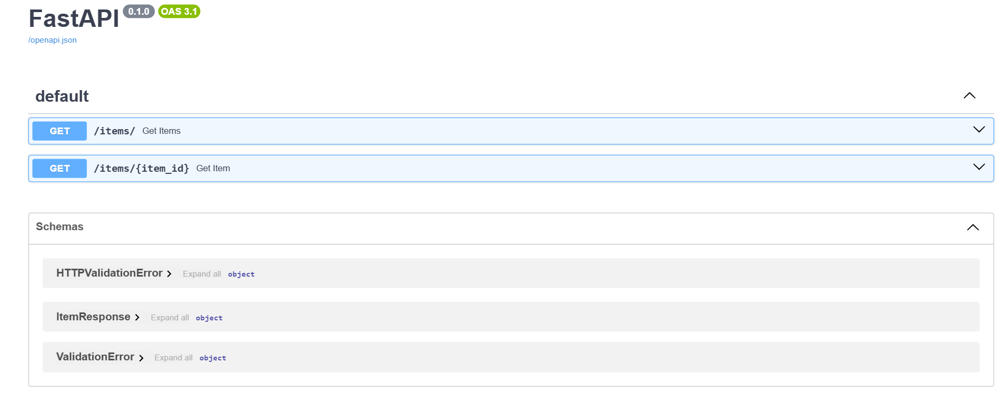

## FastAPI Items API

Proyek ini adalah **API sederhana menggunakan FastAPI dan SQLite** untuk mengelola data items.  
Mendukung operasi **Read (GET)**  melalui dua endpoint utama:  

| Endpoint         | Method | Deskripsi                                           | Response Model     |
| ---------------- | ------ | --------------------------------------------------- | ------------------ |
| /items/          | GET    | Mengambil semua item                                | List[ItemResponse] |
| /items/{item_id} | GET    | mengambil satu item berdasarkan ID                  | ItemResponse       |

## Tujuan Project
Proyek ini bertujuan untuk membuat **API sederhana menggunakan FastAPI dan SQLite** untuk mengelola data items.  
Hands-on ini mengimplementasikan **FastAPI + SQLAlchemy + SQLite** dengan **validasi Pydantic** untuk memastikan data output sesuai format, serta membiasakan penggunaan **Swagger UI** untuk dokumentasi interaktif.

## 📁 Struktur Project

```bash
fastapi-items-sqlite/
├── README.md        # Dokumentasi proyek  
├── database.py      # Konfigurasi koneksi database dan session SQLAlchemy
├── main.py          # FastAPI app & endpoints  
├── models.py        # SQLAlchemy ORM models (struktur tabel)
├── requirements.txt # Daftar library/dependencies yang dibutuhkan 
└── schemas.py       # Pydantic schemas untuk validasi data
```

## Tools & Library yang Digunakan

- **Python** – Bahasa pemrograman utama untuk membangun API.  
- **FastAPI** – Framework web modern untuk membuat REST API dengan cepat dan efisien.  
- **Uvicorn** – ASGI server untuk menjalankan aplikasi FastAPI.  
- **SQLAlchemy** – ORM (Object Relational Mapper) untuk mengelola database SQLite melalui model Python.  
- **SQLite** – Database ringan untuk menyimpan data items.  
- **Pydantic** – Library untuk validasi dan serialisasi data input/output API.  
- **VS Code** – IDE/editor yang digunakan untuk menulis dan mengelola kode proyek.  
- **Git & GitHub** – Version control dan hosting repository.  
- **Swagger UI** – Dokumentasi interaktif otomatis dari FastAPI untuk mencoba endpoint.
  
## Installation & Run
**Clone repo** 

1. git clone https://github.com/Mirnafebriasari/fastapi-items-sqlite.git
2. cd fastapi-items-sqlite

**Virtual environment**
```bash
1. python -m venv .venv
2. source .venv/bin/activate  # Linux/Mac
3. .venv\Scripts\activate   # Windows
```
**Install dependencies**
```bash
pip install -r requirements.txt
```
**Jalankan di terminal**
```bash
uvicorn main:app --reload
```
**Jalankan di server**
```bash
http://127.0.0.1:8000/docs
```
## Swagger UI


